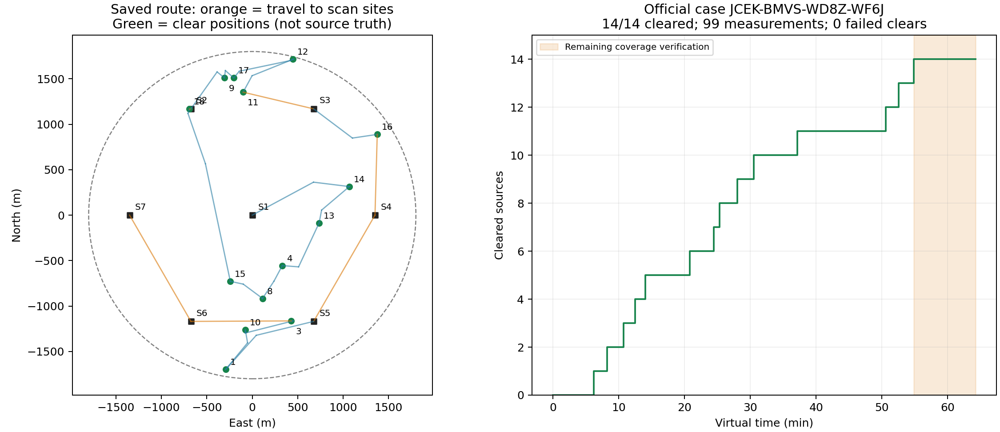

# 问题三改进策略首次实际演练复盘

案例：JCEK-BMVS-WD8Z-WF6J；程序运行目录：20260911-002124-7b080d；分析日期：2026-09-11。

结论：官方 result.json 确认场内 14 个全向源，动作响应确认成功清除 14 个，零失败，正常 user_exit。总虚拟耗时 3854.083567 s，平均每源 275.291683 s，累计移动 16020.418 m；本地脚本墙钟 1.75 s。

官方结果文件只提供案例与真实总数，不含逐源真位置，也不单独提供成绩总时间；耗时来自保存的官方 API 响应，已按原始动作独立重算。没有解密 .jlog/.psum，没有连接或重新运行模拟器。

## 结果核对

- 115 个唯一动作：enter 1、measure 99、clear 14、exit 1；115 请求和115响应，均一次接受，没有重试、拒绝或未确认动作。
- 4 份当场源码哈希与 manifest 一致。逐动作时间守恒最大偏差 4.87e-07 s，符合响应小数舍入。
- 重建39次正观测的完整约束，对每个区域做16方向 LP 支持函数检查，共 624 项；最大差异 1.23e-11 m。14次清除点都通过顶点最坏距离复核。
- 未发现的频道2、5、6、7、19、20均有7个测站的真实 no_signal 记录；从动作记录重新构造的整格覆盖最小半径余量 60.621 m。不是仅相信 summary 中的完成标志。

## 时间花在哪里

| 项目 | 虚拟时间/s | 占比 |
|---|---:|---:|
| 移动 | 3204.084 | 83.13% |
| 99次检测 | 495.000 | 12.84% |
| 85次检测频道切换 | 85.000 | 2.21% |
| 14次成功清除 | 70.000 | 1.82% |
| 清除失败 | 0.000 | 0.00% |

按动作用途分，扫描点检测74次、专门定位检测25次。39次正观测中包含14次首次发现，其余25次为定位补测；14个源平均新增1.79次定位检测。由此看，继续减少测量次数的直接收益有限，路线仍然是主要优化对象。

## 七个阶段

| 顺序 | 测站坐标/m | 清除频道 | 扫描/定位检测次数 | 路程/m | 总时间/s |
|---|---|---|---:|---:|---:|
| 1 | (0, 0) | 14, 13, 4, 8, 15, 18 | 20/10 | 5219.7 | 1248.94 |
| 2 | (-675, 1169) | 9, 17, 12, 11 | 14/6 | 2222.6 | 582.51 |
| 3 | (675, 1169) | 16 | 10/2 | 1607.2 | 397.45 |
| 4 | (1350, 0) | 无 | 9/0 | 888.4 | 231.68 |
| 5 | (675, -1169) | 1, 10, 3 | 9/7 | 3628.0 | 831.61 |
| 6 | (-675, -1169) | 无 | 6/0 | 1104.5 | 256.90 |
| 7 | (-1350, 0) | 无 | 6/0 | 1350.0 | 305.00 |

阶段按实际访问顺序划分，包含到该扫描站的移动、在站检测及该站发现目标的定位清除，不将这些总时间误称为纯定位时间。

最后一个源在 3292.188 s 清除；之后用了 561.896 s（全程 14.58%）完成余下两个测站、12次无信号检测。该段不是可以直接删掉的浪费：程序当时不知道总数为14，还需排除其他频道。第四站也没有发现新源，但其无信号记录参与完整覆盖。

## 前两问的方法在实际接口上是否成立

- 区域交会起效：频道4从750.14 m缩至16.33 m，仅增加一次检测就可清除；频道11最终半径19.41 m，也在19.5 m余量内完成。
- 较难的频道14、12、1、3各有3次补测。例如频道3半径750.17→48.62→20.94→约5 m；20.94 m时没有冒险使用20 m清除判据。
- 25次专门定位测量全部收到 direction 或 near，没有在保证接收点丢信号；14次可靠清除全部成功。这是本局对实现的支持，不证明所有误差场和所有案例都无失败。
- 末次near的频道16、3原地清除，其余安全点的最坏距离约19.5 m。清除位置是距真源20 m内的位置，图中的绿点不能当作真实干扰源坐标。

## 与旧演练的比较

| 运行 | 已清除 | 总虚拟时间/s | 每源平均/s | 路程/km | 检测数 | 清除失败 |
|---|---:|---:|---:|---:|---:|---:|
| 20260910-200250-9fb269 | 14 | 6446.68 | 460.48 | 27.248 | 163 | 11 |
| 20260910-222119-6cd63e | 16 | 6684.96 | 417.81 | 27.595 | 190 | 15 |
| 20260911-002124-7b080d | 14 | 3854.08 | 275.29 | 16.020 | 99 | 0 |

相对第一局14源旧演练，总时间低 40.22%，路程少 41.21%；相对第二局16源旧演练，每源平均时间低 34.11%。这三局案例不同，目标数相同也不代表场景相同，不能将这些差值作为策略因果提速或直接替代同案例配对。

## 下一步分析优先级（本轮不改策略）

1. 优先联合安排“补充观测点—处理目标—下一搜索站”，而不是只按当前包围圆中心排序。本局频道18的一次定位移动达1322.35 m；它在第一站最后处理，随后又到附近第二站扫描，值得检查能否把已知目标定位与测站访问合并。任何替代点须继续核对接收和信息增益，不能假设新测点会得到现有日志的同一读数。
2. 面向未覆盖区域选择下一测站，并把必要的剩余频道检测安排在已有路径上。目标是减少搜索证明所需的额外路程，不是删除覆盖证明。此前全量机会扫描已在合成消融中增时；应测试更有针对性的规则，不能仅凭本局就重新打开。
3. 通过相同案例的新旧策略配对检验效果，再谈参数微调或稳定提升比例。本轮不启动新演练，也不从已加密的官方日志臆造反事实目标位置。

局限：这是一局实际演练成功，不是正式测试成绩或普遍最优证明。仍需保留近源聚集样例劣化、有限定位步数没有普遍完成证明等已有风险。

证据：evidence/ 保存当场可读日志、摘要、manifest及官方结果/.jlog/.psum，附SHA-256。官方目录会随后续运行改变，报告以本分析目录冻结副本为准；源码仍使用当场 source_snapshot。