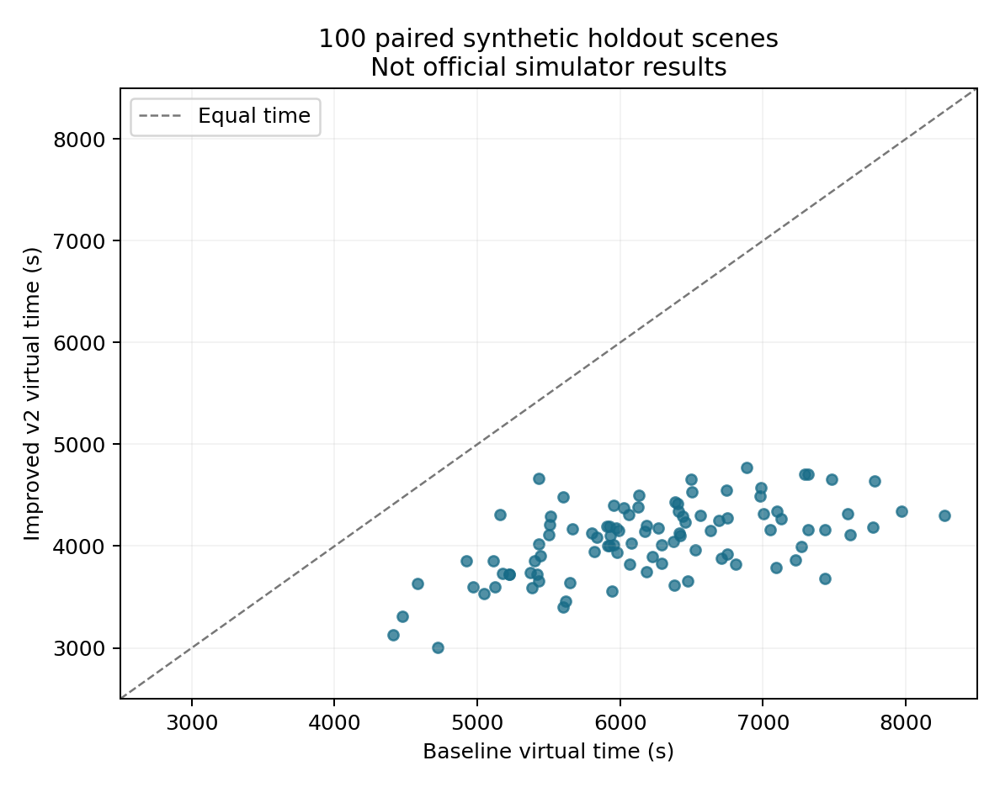

# P3 v2 离线验证报告

日期：2026-09-11。验证状态：离线世界与本地接口检查通过；采用状态：候选，待用户官方演练。

所有场景均为本地构造，规划器只能取得仿 API 测量，真值仅供独立计时和正确性断言。这里没有连接官方 2026 端口、登录账号或生成官方成绩。

| 批次 | 策略 | 全清场景 | 平均虚拟时间/s | 平均路程/m | 平均测量数 | 清除失败总数 |
|---|---|---:|---:|---:|---:|---:|
| R003-final | baseline | 76/76 | 6155.98 | 25630.94 | 168.41 | 744 |
| R003-final | improved | 76/76 | 4105.69 | 17162.97 | 103.71 | 0 |
| R004-holdout | baseline | 100/100 | 6231.55 | 25988.98 | 169.74 | 930 |
| R004-holdout | improved | 100/100 | 4069.54 | 16906.75 | 106.66 | 0 |

留出集的平均总虚拟耗时降低 34.69%，100/100 场均较旧策略快。这个百分比是相同场景的平均总时间之比，不是官方平均清除时间的保证。

R003 包括均匀圆域的 30 场固定位置正弦误差、30 场恒正/恒负/棋盘式 ±1° 误差，以及 16 场边界、近原点、近共线聚集及接收半径 1000 m 等构造。R004 固定最终参数后使用 seeds 30–129 的另外 100 场；R003 的主要随机种子为 0–29。留出误差仍为固定位置正弦误差，因此不覆盖所有允许的误差场。

最终版 176 场共核对 6568 个观测区域的真值包含关系、2253 个清除证书。区域断言用多边形有向边叉积，独立于测向半平面生成；清除用真值距离与接口独立判断。检查无错误排除实际频道。

几何反例：边长 38 m 等边三角形 D=38 m，但最小包围半径 21.9393102292 m；程序拒绝据 D≤40 清除。七测站使 13104 个完整保留方格全部被半径 999.99 m 覆盖；只在原点检测则不会错误证明全域覆盖。另检查 0/360° 跨界和舍入端点。

七测站连续几何参照最坏最近距离：923.913707 m。证书对应整格最大角点距离，不是网格中心抽查。

4 项本地 HTTP 测试通过，见 client-test-output.txt：丢响应重试同 ID/同字节；明确拒绝不重置时钟/位置；畸形响应可重试、clear 不改变检测频道；不确定状态停止新动作。第四项以完整命令行程序连接随机本地端口上的独立世界，实际覆盖 enter→measure/clear→exit、源码快照、summary 和移动/切换统计。测试脚本共 4 个测试方法，其中一个方法组合检查多个行为。

消融与未解决问题：

- 开发前 10 场：关闭机会扫描 4075.59 s，开启 4489.42 s，故交付版默认关闭。固定编号顺序 4848.50 s，比相同 10 场最终版更慢。
- R003 中 4 场比旧策略慢：索引 62, 63, 70, 71。均为距离原点约 5.001 m 的 10 源聚集构造，首测不触发 near，中部侧向探测的步幅过大。这说明本版并非逐场支配旧策略。
- 单目标 16 步预算内全误差情形的完成性未经证明；若不能收敛则明确未完成退出，不宣称成功。
- 圆和角域保守外包、清除与接收余量降低浮点风险，但不是区间算术的机器可验证证明。
- 程序在独立本地世界中的规划时间每场不足 0.14 s；不含完整 HTTP 与磁盘日志成本，官方真实时间需要实际演练。

复现：在仓库根目录执行 verification/verify.py（完整相对路径见各 run/manifest.json 中 command），使用同目录 source_snapshot/simple_robot.py 作为冻结基线。结果输出目录必须为新目录，不能覆盖已有 R001–R004。依赖 numpy 2.2.6、scipy 1.15.3；报告另需 matplotlib。

R001 是开发小样例；其 manifest 中 triangle_radius 因当时报告变量复用记录了后续例子的半径，三角形拒绝清除断言本身通过。此记录不作为最终数字来源；R002 以后已修正，保留原始记录和快照。

