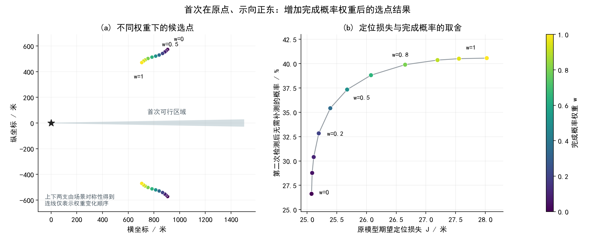

# 期望损失与免补测概率加权实验结果

日期：2026-09-13。模型 Q2-expected-finish-M01-v01，算法 A01，运行 R001。状态：完成探索性数值求解与分项核查，尚未被采用到论文；没有修改论文、原模型、旧代码或旧结果。

## 评价指标与权重

原模型 J(q) 完整保留，只有可以在当前检测点原地完成光学定位的反馈才计零损失，其余反馈取剩余区域的最小包围圆半径。新增 P_finish(q)=Pr(rho(K_Z(q))<=20 | I1,q)，衡量第二次检测后是否已经无需继续无线电测向；允许再移动到包围圆圆心，随后完成光学定位。强信号、无信号及正常读数均纳入该事件。

最小化 F_w(q)=(1-w)J(q)/20+w[1-P_finish(q)]。w是完成概率的权重，0为原模型，1为只最大化完成概率。20米取自任务的光学定位尺度，用于消除量纲；这是一种评价约定，不是由题面推出的唯一归一化。改变尺度会改变权重的解释，不应将w=0.5描述为客观最优的偏好。

在w=1处，数值相同的完成概率优先取J较小的代表点。程序仅为数值平局加10^-10 J/20；在本轮报告精度上不改变概率最优值，不把单个代表点称为全部概率最优点。

## 原点、正东基准情景

目标圆心为原点，首次检测点为(0,0)，第一次示向度为0°。下表单位为米；正负纵坐标分别表示由对称性得到的两支。坐标显示精度不是连续最优坐标的误差保证。

| 完成概率权重 w | 第二检测点 | 期望定位损失 J | 无需补测概率 |
|---:|---|---:|---:|
| 0 | (906.62, ±572.79) | 25.0757 | 26.62% |
| 0.05 | (895.79, ±562.29) | 25.0862 | 28.77% |
| 0.1 | (885.87, ±554.03) | 25.1125 | 30.40% |
| 0.2 | (867.44, ±541.79) | 25.1970 | 32.84% |
| 0.35 | (840.92, ±529.58) | 25.3912 | 35.42% |
| 0.5 | (813.82, ±521.02) | 25.6746 | 37.34% |
| 0.65 | (785.07, ±513.09) | 26.0760 | 38.81% |
| 0.8 | (754.03, ±502.36) | 26.6506 | 39.89% |
| 0.9 | (731.42, ±490.73) | 27.1956 | 40.37% |
| 0.95 | (719.10, ±482.25) | 27.5564 | 40.51% |
| 1 | (705.54, ±470.67) | 28.0245 | 40.57% |

这组11个权重给出北侧11个代表候选点及其南侧镜像，共22个点。权重增加时，候选点在本次搜索中逐步向首次检测点一侧移动，完成概率提高，期望半径损失也增加。这里只得到离散权重对应的点集；连线用于呈现变化顺序，不表示已证明连线上每个位置都最优，也不把两支之间填充为候选区域。

与w=0相比，w=0.2仅将J提高约0.1213米，完成概率增加约6.22个百分点；w=0.5将J提高约0.5989米，完成概率增加约10.72个百分点。w=1的完成概率最高候选值约40.57%，但J增至28.0245米。后段概率收益逐渐减小。w=0.2至0.5值得作为较温和的折中进行比较，尚不存在唯一正确的权重。

所有这些原点候选的原地光学定位概率均为0。表中的完成概率表示反馈之后，剩余区域能被某个20米圆覆盖，机器狗仍可能需要移动；它不是在第二检测点原地找到源的概率，也不是源以该概率落入随意选定的20米圆。

## 边界情景检查

| 首次点横坐标 a | 示向度 beta | 各权重共同采用的代表点 | J | 无需补测概率 |
|---:|---:|---|---:|---:|
| 1700 | 0° | (1770.10, 41.96) | 1.8782 | 100.00% |
| 1700 | 90° | (1454.62, 412.06) | 10.7279 | 100.00% |
| 1780 | 0° | (1792.50, 0.00) | 0.0000 | 100.00% |

在a=1700的两个情景中，原期望损失的最好候选已经达到约100%的完成概率，新增指标没有形成有意义的折中，按J择优仍选择同一点。在w=1时可能有许多同为100%的位置，这里按J给出一个代表。对a=1780、beta=0°，首次区域本身已有半径小于20米的包围圆，推荐圆心同时取得J=0与P_finish=1，故所有权重均达到理论全局下界0。这些只是四个代表情景，不代表整个连续参数域。

## 算法、预算与实际运行

采用原模型的圆弧几何与分段Gauss积分。新增完成事件的半径20米交点搜索，将正常反馈角度在这些位置分段后再积分；搜索用较低精度，最后采用高精度复算。阈值根搜索属于数值扫描与二分，不声称穷尽所有可能的连续几何事件。

外层采用100米覆盖网格、源区域附近细网格、约5个分散初值加原模型基线初值、Nelder-Mead局部细化，以及两处不同低值区域的高精度再搜索。对称情景在上半平面搜索，最终独立复算镜像；一般情景保留两侧。每个试探点检查q不同于首次点、到K1的距离不超过1500米。局部搜索最多150次迭代，高精度再搜索最多130次，达到上限会保留诊断。J与P的共同优势用于边界情景的权重复用，不用重复求相同问题。

四情景主搜索共评价12,090个位置与精度组合，分情景实测耗时合计63.69秒；部分情景并行执行，该合计不是实际墙钟时间，也不包含独立核查和绘图。初次加载、机器负载与积分难度会影响耗时。原点另使用50米、偏移25米的覆盖网格补查，评价2,902次，未找到优于所报加权候选的网格节点。最终还在0.1、1、5米尺度上作邻域复核，未发现更好点。

## 数值核查

- 对8个代表点进行积分精度和阈值扫描加密；最高两档J差最大3.66e-09米，完成概率差最大4.6e-14。这些是固定点的数值一致性，不是全局搜索误差界。
- 新实现对原J的复算，与冻结原实现的最大差为1.42e-09米；核查新增概率未误改原目标。
- 概率归一化残差最大8.9e-13；检查了P_finish不小于原地定位概率及强信号概率，镜像核查通过。
- 独立射线交区与有限支撑圆枚举完成60组检查，包含20米阈值两侧。独立点集半径下界与主算法连续区域上界最大差约0.000775米，抽查中没有无法判定阈值侧别的情况；它不构成全域几何误差证明。
- 对6个代表点各模拟60,000个相容场景，共360,000个有效场景。J的最大标准化偏差为2.479个标准误，完成概率为1.343个标准误，未发现明显冲突。模拟共享几何内核，只用于独立核对概率更新与期望积分；几何由另一条射线途径检查。每个场景始终共享固定的接收半径，新地点误差在该场景内取固定值，没有同地点重复测量平均。

专门检查了一个无信号也足以完成测向的算例：首次点(1700,0)、示向正东，第二点取(770,0)。无信号概率约1.6241%，该分支剩余区域的包围圆半径约15.0754米，而当前点到区域最远距离约1030米。因此该分支计入免补测概率，但不计入原地光学定位概率。它是分支核查点，不是优选点。

## 结论与限制

新增指标在原点基准中提供了实际区分能力，可以用较小的平均定位损失增量换取更高的免补测概率；它不是所有情景下都能改变决策。当前证据支持进一步讨论采用方式，不足以宣布连续全局最优，也不能直接把点集当成有面积的候选区域。期望损失与完成概率均依赖原模型的均匀先验及独立性假设，本次没有进行先验敏感性研究。

原论文及基础研究文件未修改、未提交、未推送。完整候选点见[CSV](results/全部权重候选点.csv)，分项验证见 `verification/`，模型与输入快照见 `inputs/`。重新计算应运行 `src/reproduce.py`，该入口会创建独立的复现目录，保留本次结果。
