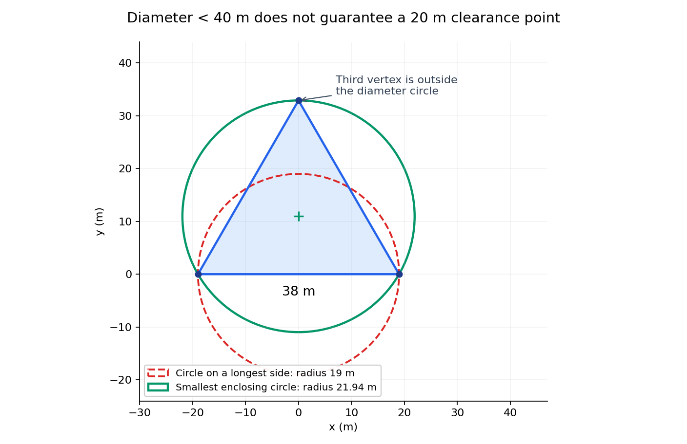

# B题24篇参考论文：逐篇分析与模拟器策略映射

日期：2026-09-10。本文依据收到的论文全文、B题题面及附件，以及简单策略的完整演练日志撰写。

## 1. 结论先行

这批文献最能帮助我们解决三类问题：**把测向结果变成可靠的位置范围、选择更有价值的下一观测点、组织多个目标的搜索与定位任务。** 对问题1的基础支持很强，对问题2有较完整的几何与主动定位方法，对问题3提供可组合的模块；对问题4中“未知朝向、半圆可见、有限接收半径、必须找全”的组合条件，尚未发现可以直接移植的完整方案。

最应优先使用的是 **01＋02＋11 → 定位范围与清除保证，03＋04 → 下一观测点与时间成本，05＋09＋15 → 多目标统筹与搜索覆盖**。07、10、13适合核对几何结论，19适合说明简单追随策略的基线地位。12可启发鲁棒规划，但不能因为标题有“未知定向辐射源”就认为第四问已经解决。

这里的“能帮助解决”指能提供模型、算法部件或论证依据。**本轮没有实现或运行新的策略，不能宣称这些方法已提高模拟器成绩，也不能把论文自己的提升百分比当作我们的提升幅度。**

### 资料与阅读范围

- 收到并上传的是24篇PDF全文，共245个PDF页面，外加原始阅读索引、CSV/JSON文献清单和校验清单。24篇PDF的SHA-256均与随附校验记录一致；上传后再次核对Git中的PDF内容一致。
- 本文逐篇核对主要问题、模型、方法、实验结论和迁移限制；对相关度高的推导、算法与图表重点阅读。07为扫描件、11文本编码异常，均逐页查看原始页面。没有逐式复推全部证明，也没有复现24篇论文的实验。各篇条目列出关键阅读页，均指PDF页码，可能包含平台封面。
- 原索引另列9条未获PDF的线索，**不属于24篇全文**。本轮只核对了线索记录，没有把它们当作已读全文或核心证据；见第7节。
- 原始索引和论文保持原样；本文单独记录进一步阅读后的修正意见。附件中的建议不作为任务指令。

## 2. 先对齐B题和已有演练

### 2.1 决定论文能否使用的题设

| B题事实 | 文献迁移时的含义 |
|---|---|
| 静态源、已知机器狗坐标、20个频道且每频道最多一个源 | 不需要估计目标速度、机器人SLAM或匿名多源数据关联；但仍不知道哪些频道存在目标 |
| 示向度误差有界于±1°，同一地点重复检测误差不变 | 有界可行域比未经验证的独立高斯滤波更适合承担保证；原地重复测不能获得独立样本 |
| 接收半径未知但在1000—1500米 | 不能把无限可见的几何布置当作始终能测到；无信号也可能提供排除信息 |
| 第四问的发射源仅在朝向两侧各90°内辐射，范围内场强不随角度变化 | 连续天线增益、接收天线转向、间歇发射三种模型都不能直接替代半圆可见性 |
| 不能边走边测；检测每次5秒、换频道1秒、行走5米/秒 | 轨迹上经过某个地方不等于检测过；一次停点测多个频道仍需逐一计费 |
| 距源≤20米可光学定位并清除，与发射朝向无关；光学3秒，成功后清除2秒 | 目标是到达可成功清除的位置，不必无限提高坐标估计精度 |
| 距源≤5米且在可见范围内可返回近距离状态 | 近距离状态已经足以清除，无须再强求方位角 |
| 总数10—16但事前未知，要求确保全部清除 | 清了14个、某段时间没发现新源、后验概率高，都不能独立成为普适结束证明；清了16个则可利用题设上限 |

本文沿用本地提供的题面与附件说明。关于评分，不推断题目未公布的分数权重；关注题面明确要求的清除比例、总/平均虚拟时间与程序运行时间。

### 2.2 已完成演练给出的优化顺序

简单策略为中心及六个外围扫描点，发现源后按频道顺序沿示向度追近，出现大角度反向时减半步长。该次演练清除了14/14个源，完成率100%，但一次全清只证明这个案例成功，不代表对所有场景都有保证。

| 项目 | 实测 |
|---|---:|
| 总虚拟时间 | 6446.675秒，约107分26.68秒 |
| 总移动距离 | 27248.376米 |
| 移动时间 | 5449.675秒，占84.5% |
| 测向/无信号检测 | 163次，815秒，占12.6% |
| 换频道 | 79次，79秒 |
| 清除调用 | 25次：14成功、11失败，共103秒 |
| 最后一次成功清除后仍花费 | 527.457秒，约8分47秒，占8.2% |

所以第一优先级是**减少长距离往返和不划算的定位移动**，而非只追求少换几次频道或减少代码运算时间。以本题速度，少走1公里节约200秒；即使消除这次全部11次失败清除，也只直接省33秒。定位判据仍有价值，因为它还可能减少近目标反复试探，但这部分收益必须重新测试。

最后527秒不能直接标记为浪费。运行时并不知道实际只有14个源，继续排查尚未发现的频道承担了找全的作用。真正应优化的是：**能否利用此前全部检测位置形成更便宜的覆盖证明，并只去尚未排除的地方。**

## 3. 最关键的帮助：让问题1直接服务清除

### 3.1 从交点估计改为位置可行域

对于位置为s的检测点，测得示向度θ后，可以用以θ为中心、两侧各1°的正向角域限制目标位置。将同一频道的所有有效测向角域相交，得到可行区域P。01给出有界不确定性的研究基础，02说明如何从顶点计算最坏位置误差。

问题1要求的是交会定位多边形本身的直径。应先明确区域定义，计算顶点并取最远点对；若几何退化导致区域无界，应报告无界，不能悄悄加截断后仍称为原问题的直径。在问题3、4的实际策略中，可以另行结合1800米目标圆域、接收距离等真实先验收缩区域。

实现时适合用方向向量与叉积形成半平面，避免直接使用tan造成垂直方向溢出；还要处理0°/360°跨界、近乎平行、空交集以及数值容差。若接口先加入±1°误差再四舍五入到0.01°，保守集合需计入最多0.005°的额外舍入；应按具体接口语义核对，不应假定重复测量能消除误差。

### 3.2 直径小于40米，不足以保证存在20米清除点

设P的顶点为v₁,…,vₙ，定义：

\[
D(P)=\max_{i,j}\|v_i-v_j\|,\qquad
R(P)=\min_q\max_i\|v_i-q\|.
\]

D是区域直径，R是最小包围圆半径，**两者一般不满足R=D/2**。例如边长38米的等边三角形，其直径38米，而最小包围圆半径为38/√3≈21.94米。任意半径19米的圆都无法覆盖它，也不存在能保证距离所有可能位置都不超过20米的点。这说明不能一般地认为“以区域直径为直径的圆能覆盖区域”；具体区域应单独判断。

对拟清除点q，真正需要的条件是：

\[
\max_{x\in P}\|x-q\|\le20.
\]

对凸多边形，这个最大值可通过顶点计算。存在这样的q，当且仅当R(P)≤20。**01/02得到可信区域，11求最小包围圆，组合起来才得到明确的保证型清除判据。**

进一步，由本题动作条件可推导所有安全清除位置的集合：

\[
C(P)=\bigcap_i\{q:\|q-v_i\|\le20\}.
\]

如果该集合非空，可以考虑从当前位置到其中最近的点，未必每次都走到最小包围圆圆心。这是结合文献与B题得到的设计方向，**不是11原文已经给出的机器人最短路线算法**。保证也以P确实包含真位置为前提：内缩网格、错误删点、忽略舍入，都可能破坏保证；保守外包区域则可能牺牲效率但保留保证。

## 4. 问题2、3：论文可以改善哪些决策

### 4.1 第二个检测点不能只写“夹角90°”

06、07、10、13的结论共同提醒我们：最优角要与固定哪些距离、什么噪声模型、什么精度指标一起说明。问题2仅给第一次位置和示向度，没有给真实目标距离。因此“绕目标转90°”本身不是可执行策略，除非说明用什么估计、怎样应对估计错误。

可采用的建模方向是：从第一次观测得到目标候选区域，对多个可达的第二检测点，评价接收可能性、交会几何、最坏或平均区域收缩以及行走费用，给出满足筛选条件的候选区域。保证型评价和带分布假设的平均评价应分开报告。03提供成本权衡思路，04提供低复杂度候选安排，07等帮助检查其几何合理性。

### 4.2 应评价整个动作的成本，而不是单一几何指标

本题的基本时间账为：

\[
T=\frac{L}{5}+5N_{measure}+N_{switch}
  +3N_{clear\_attempt}+2N_{clear\_success}.
\]

03最直接支持把行走和检测统一评价；23还包含定位后抵近现场的时间。对我们而言，可比较“在附近测一次后再清除”和“直接去当前可信的清除区域”等方案的后续总成本。评价下一观测点时应计入去该点、检测、后续抵近等费用，不能为了好看的交会角绕很大的圈。

04的距离减半/转角原则可作为候选策略，但不是当前脚本的“方向反转后步长减半”：前者围绕估计目标安排观测几何，后者主要在过冲后缩短追随步长，作用不同。

### 4.3 多目标应共享行走与历史观测

05的主要启发是一个位置可以对多个目标同时有价值；09、21启发空间聚类和不同候选区域之间的路线组织。我们的适配方向是维护各频道的观测历史，在选择一个停点时累计它对多个未清除源的帮助，并比较不同清除顺序，减少按频道号依次追踪导致的来回穿行。

这里能共享的是**行走和停点位置**，不是免费观测：同一位置测三个频道，仍有三次5秒检测及相应切换成本。已清除频道无需再排查，未发现频道仍需覆盖证明。05假设所有目标一开始就可见，所以首次搜索层还必须另建。

### 4.4 未发现频道也应维护可排除区域

对第三问全向源，一个停点在某频道返回无信号，可排除该点1000米范围内存在该频道未清除源的可能性，因为接收半径至少1000米。将该频道历次无信号停点的覆盖圆取并集，与目标圆域比较，可研究剩余尚未排除区域。

这是由题设接收下界直接推得的逻辑；09、15提供搜索状态与覆盖评价的启发，但不是该结论的原始证明。覆盖必须按频道记录，不能把没检测过该频道的经过点算进去。有限网格上“没有空格”也不自动证明连续圆域全覆盖，应检查圆弧交点、边界或采用有安全余量的几何覆盖方法。

当前中心加六外围点可作为全向搜索的保守基准。改进目标是在保持找全依据的前提下，复用追踪过程中的有效停点，减少固定扫点之间的回访。

## 5. 问题4：文献尚未补上的部分

### 5.1 必须区分三种“收不到”

第四问中一个频道无信号，可能是无此源、距离超过其接收半径、或者位于发射源背向半平面。09、14、15、20、21主要处理的间歇发射，不能用来解释确定性的背向盲区；原地等待或重复测向不会因此恢复信号。

12最接近方向性主题，但它用连续高斯型天线增益、TDOA＋AOA及机群部署。其第5页以给定天线电轴向量计算夹角，没有给出适配本题的“未知朝向估计＋180°硬可见域＋保证全发现”闭环。

对于某个假定存在的定向源，可用位置x、朝向单位向量a、半径r描述状态。停点s能接收必须满足：

\[
\|s-x\|\le r,\qquad a^T(s-x)\ge0,
\quad r\in[1000,1500].
\]

有信号还给方位约束；无信号则意味着距离条件或朝向条件至少一个不满足。把两者都用于更新状态，是我们需要自行完成的适配工作。实际还应保留该频道无源/全向源等假设。仅保留二维位置、把无信号一律当作距离太远，会误删真实目标。

### 5.2 全向覆盖不等于定向覆盖

一个与所有扫描点距离都很近的源，仍可能背对这些点。尤其目标靠近1800米圆域边缘、朝外辐射时，只在圆域内部扫描会很不利。极端地，源位于边界且朝外，它的可见半平面与圆域内部没有交集；仅靠内部不同位置测向没有普适发现保证。

这不是说该源不能清除：20米内光学操作不受朝向限制，题面也允许机器狗走到目标圆域之外，坐标只受接口数值边界限制。但外侧检测点、绕行/补扫方式、对所有可能朝向的覆盖证明及成本，需要另行设计。**这正是当前文献组合和简单策略都没有完成的关键部分。**

## 6. 24篇逐篇评估

以下等级表示对当前B题的使用优先级，不是期刊或论文学术质量排名。编号沿用原包，方便与原索引、PDF及文献清单互查。

### 01　Sensor Placement and Selection for Bearing Sensors with Bounded Uncertainty

Pratap Tokekar; Volkan Isler，2013。**核心：问题1、2**。

- **论文实际解决：**把测角误差视为有界不确定性，用扇形交集的直径或面积评价定位质量，并研究传感器布置和子集选择；不必先假设误差服从高斯分布。
- **对B题的帮助：**为“每次观测排除哪些位置”“多次观测后如何得到保证包含真值的区域”提供最贴合题目的基础。也说明信息互补的少量观测可能比许多几乎共线的观测有效。
- **不能直接照搬：**主要处理静态部署、最坏情况几何及近似保证。文中的三角网格、常数因子和少量传感器结论有各自条件，没有同时解决接收半径、单机器狗行走、多频道和清除成本，不能拿来证明B题整条策略近似最优。
- **关键阅读位置：**PDF 第1—6页，尤其第2—5页。

[仓库全文](<论文全文/01_有界测角误差下的传感器布置与选择.pdf>) · [原始来源](https://tokekar.com/pubs/tokekar2013asensor.pdf)

### 02　Characterizing the Worst-Case Position Error in Bearing-Only Target Localization

Mohammad Reza Gholami; Sinan Gezici; Henk Wymeersch; Erik G. Ström; Magnus Jansson，2015。**核心：问题1及清除判据**。

- **论文实际解决：**将有界方位观测转化为线性不等式，以可行多面体顶点计算给定位置估计的最大可能误差，并讨论外包椭球。
- **对B题的帮助：**对拟清除点q，检查所有可行区域顶点到q的距离，就能得到保守的最坏位置误差；这比只输出一个交点更有用。与11结合，可连接到20米清除条件。
- **不能直接照搬：**外包椭球不是最小包围圆，椭球体积也不是题目中的直径。论文为推导采用特定角度/目标区域约定；实现时需处理360°跨零、垂直方向、平行或近乎平行的射线、无界或空交集。
- **关键阅读位置：**PDF 第3—5页，式(16)—(19)。

[仓库全文](<论文全文/02_纯方位定位的最坏位置误差界.pdf>) · [原始来源](https://publications.lib.chalmers.se/records/fulltext/218784/local_218784.pdf)

### 03　Cautious Greedy Strategy for Bearing-only Active Localization: Analysis and Field Experiments

Joshua Vander Hook; Pratap Tokekar; Volkan Isler，2014。**核心：问题2、3的时间目标**。

- **论文实际解决：**主动定位同时计算移动与非零测量时间；谨慎贪心策略依据不确定性椭圆安排下一观测，兼顾几何改善和接近目标，并给出条件性分析与野外实验。
- **对B题的帮助：**最接近本题“为什么值得绕一点路再测一次”的决策。可借鉴根据不确定性长轴安排侧向观测，以及用总成本评价动作，而非只追求测量次数少或定位方差小。
- **不能直接照搬：**高斯噪声、EKF和特定天线的180°方位歧义都与本题不同。示例测量时间120秒、角噪声15°等参数及其近似常数不能直接移植。初始化依赖较便宜的信号探测，B题确认无信号也要5秒，沿接收边界反复探测未必合算。
- **关键阅读位置：**PDF 第3—8、12—14、19—20页；未逐式复推附录证明。

[仓库全文](<论文全文/03_兼顾移动与测量耗时的谨慎贪心主动定位.pdf>) · [原始来源](https://josh.vanderhook.info/media/pdf/JoshV_JFR_2013_Localization.pdf)

### 04　卫星导航干扰源无人机定位观测路径规划方法

姚胤博; 许睿; 徐悦; 刘睿; 陈奇东，2024。**核心：问题2、3的中文算法参考**。

- **论文实际解决：**比较几何精度因子及定步长、不定步长、均匀配置等观测点安排，指出初始两点交会角差会使后续定位恶化；提出相对当前估计距离减半、方位增加90°的顺序规划。
- **对B题的帮助：**可以据此构建具有解释性的观测点策略和对照实验，检验“沿方位追近”与“先获得侧向视差”的差别。它尤其提醒我们单独测试很差的初始交会几何。
- **不能直接照搬：**论文有200米定位盲区、自身位置噪声及高斯角噪声；B题仅5米内可能不给示向度，20米内能清除。正文第9页说两次估计相差大时剔除旧结果，第10页图9的“距离>dn”是/否分支却与此不一致，应重新核对逻辑并做实验，不能照图复制。论文的RMSE与运算时间改进不等于B题虚拟总时间改进。
- **关键阅读位置：**PDF 第3—11页；第10页图9已看原始页面。

[仓库全文](<论文全文/04_卫星导航干扰源无人机定位观测路径规划方法.pdf>) · [原始来源](http://www.qqdwxt.cn/cn/article/pdf/preview/10.12265/j.gnss.2024097.pdf)

### 05　Active localization of multiple targets using noisy relative measurements

Selim Engin; Volkan Isler，2020。**重要：问题3的多目标统筹**。

- **论文实际解决：**通过贝叶斯栅格表示多个目标的相对观测不确定性，再用深度强化学习选择平台运动，使一条轨迹同时改善多个目标的定位。
- **对B题的帮助：**最值得借鉴的是联合评价一个观测点对多个目标的帮助：不必把每个频道当成完全独立的往返任务。可以先用小规模候选点评分实现这一思想。
- **不能直接照搬：**论文明确假设初始时所有目标已经可观测，不处理首次发现；还假设每个时刻可获得各目标观测、对应关系完美。B题只能逐频道付费检测，且总数未知。因此它没有解决全区域搜索，也不能把一次停点计为免费观测全部目标。当前不优先训练其神经网络。
- **关键阅读位置：**PDF 第1、3—7页。

[仓库全文](<论文全文/05_带噪相对观测下的多目标主动定位.pdf>) · [原始来源](https://arxiv.org/pdf/2002.09850)

### 06　存在系统误差下交叉定位系统最优交会角研究

盛丹; 王国宏; 孙殿星，2016。**辅助：问题2的误差与最优角**。

- **论文实际解决：**在交叉定位中加入测向系统误差，讨论不同误差参数及精度指标下的最优交会角，区分圆概率误差和误差椭圆面积。
- **对B题的帮助：**支持对“90°一定最优”的条件审查，并提示对非零偏差和不均衡观测质量做敏感性实验。
- **不能直接照搬：**本题给出的是空间相关、同地点固定的有界误差，并未给出论文所需的偏差均值和高斯方差。不能直接指定这些统计参数，也不能把圆概率误差作为一定能清除的上界。
- **关键阅读位置：**PDF 第1—4、6—8页。

[仓库全文](<论文全文/06_存在系统误差下交叉定位系统最优交会角研究.pdf>) · [原始来源](https://www.sys-ele.com/CN/article/downloadArticleFile.do?attachType=PDF&id=2264)

### 07　测向交叉定位系统中的最优交会角研究

白晶; 王国宏; 王娜; 徐海全，2009。**重要：问题2的几何边界条件**。

- **论文实际解决：**在固定基线长度和目标到基线距离、相应统计误差假设下，求解最优交会构型。最优角随几何比值变化，某些区域存在两个对称最优配置。
- **对B题的帮助：**很适合解释候选观测区域为什么应依赖先验几何和可移动范围，而不能只给一个“与目标成90°”的口号。
- **不能直接照搬：**这是带明确约束的几何最优化，不能与固定目标到各站距离时的最优角结论混为一谈；B题第一次观测后目标距离仍未知，需要对整个候选目标区域评价。
- **关键阅读位置：**PDF 全部7页，扫描件逐页查看。

[仓库全文](<论文全文/07_测向交叉定位系统中的最优交会角研究.pdf>) · [原始来源](https://hkxb.buaa.edu.cn/CN/article/downloadArticleFile.do?attachType=PDF&id=8781)

### 08　测向交叉定位体制下平台航迹最优规划算法

张志虎; 赵佳旻; 刘梅，2018。**辅助：问题2、3的可观性**。

- **论文实际解决：**用交叉定位的CRLB/GDOP和状态估计安排平台轨迹，讨论不同运动条件下的机动规划。侧向机动能改善只有方位观测时的信息不足。
- **对B题的帮助：**可作为“为什么纯追随会缺少距离信息”的解释和候选规划方法，适合比较加入横向动作前后的定位区域收缩速度。
- **不能直接照搬：**含运动目标状态与平台航向/机动约束；B题静态目标可降为二维位置，不需要照搬速度状态和飞机掉头约束。离线使用真实跟踪误差的评价量不能直接充当在线可获得的决策输入。
- **关键阅读位置：**PDF 第1—7页的模型、规划与仿真部分。

[仓库全文](<论文全文/08_测向交叉定位体制下平台航迹最优规划算法.pdf>) · [原始来源](https://www.zhkzyfz.cn/CN/PDF/10.3969/j.issn.1673-3819.2018.04.010)

### 09　Simultaneous Localization of Multiple Unknown and Transient Radio Sources Using a Mobile Robot

Dezhen Song; Chang-Young Kim; Jingang Yi，2012。**重要：问题3的搜索状态和路径组织**。

- **论文实际解决：**处理数量未知、匿名且间歇发射的多个源，用时空占据栅格分别描述位置存在性和发射活动；沿高概率区域的“脊线”移动，并安排区域间路线。
- **对B题的帮助：**启发我们维护未发现目标仍可能存在的区域，区分首次搜索与已发现目标的精确定位，并减少不同任务之间的无效往返。
- **不能直接照搬：**依赖RSS、接收天线方向图及随机发射过程，而B题有明确频道身份、没有RSS数值，失联主要由距离/方向决定。概率阈值发现和间歇信号的时间界都不是“全部清除”的证书；关于单个源期望搜索时间的结论也不能改写成总任务时间不随目标数增加。
- **关键阅读位置：**PDF 第1、3—10页的模型、规划与实验部分。

[仓库全文](<论文全文/09_单机器人同时定位多个未知瞬态无线电源.pdf>) · [原始来源](https://coewww.rutgers.edu/~jgyi/pdfs/IEEE_TRO_2012.pdf)

### 10　多站交叉定位相对GDOP及其测向站分布问题研究

罗双喜，2020。**辅助：问题2的多点几何评价**。

- **论文实际解决：**构造相对GDOP，分析测站距离、测向精度和方位分布对定位的作用，并给出相应条件下的最优构型。
- **对B题的帮助：**可以帮助评价多次历史观测是否主要集中在同一方向，以及新观测应补充哪个方向的信息。
- **不能直接照搬：**使用距离与测角精度形成权重；本题这些量不能全部当作已知真值。相对GDOP好不代表区域最大误差小，更不自动代表含行走费用的整条路径短。
- **关键阅读位置：**PDF 第1—5页。

[仓库全文](<论文全文/10_多站交叉定位相对GDOP及其测向站分布问题研究.pdf>) · [原始来源](https://www.zhkzyfz.cn/CN/PDF/10.3969/j.issn.1673-3819.2020.02.002)

### 11　Smallest enclosing disks (balls and ellipsoids)

Emo Welzl，1991。**核心：问题1及20米保证**。

- **论文实际解决：**研究最小包围圆/球/椭球。二维最小包围圆由至多3个边界点确定，并给出随机增量算法及期望线性时间分析。
- **对B题的帮助：**填上“区域直径”和“能覆盖区域的圆”之间的关键缺口。对定位多边形顶点求最小包围圆，半径不超过20米时，其圆心是有保证的清除点。
- **不能直接照搬：**论文给计算几何工具，不负责根据测向生成可行区域；还须处理退化点集与数值容差。若后续区域带圆弧，不能仅取任意几个弧端点就宣称包住全部区域，需计算真正极值或使用保守外包多边形。
- **关键阅读位置：**PDF 全部12页逐页查看；二维圆算法主要在第2—5页。

[仓库全文](<论文全文/11_最小包围圆及球椭球的随机算法.pdf>) · [原始来源](http://www.inf.ethz.ch/personal/emo/PublFiles/SmallEnclDisk_LNCS555_91.pdf)

### 12　面向未知定向辐射源组合定位的无人机群优化部署

赵倩倩; 熊刚; 王李军; 尤明懿，2025。**有条件借鉴：问题4的鲁棒部署思想**。

- **论文实际解决：**在目标位置不确定及天线增益随方向变化的模型中，联合使用TDOA与AOA，并以最坏位置下的定位误差界优化无人机群部署。
- **对B题的帮助：**值得借鉴的是：规划时不要只对当前一个位置估计优化，应考虑一组可能目标状态下的表现。
- **不能直接照搬：**不等于解决“未知发射朝向”。第5页式(14)以天线电轴方向向量a计算夹角，部署模型的最坏情形变量主要是目标位置；文中方向图为高斯型增益，也不是B题180°之外严格无信号的半圆覆盖。另有多机和TDOA观测，B题均不提供。只能提取鲁棒规划思想，不能当作问题4的现成算法。
- **关键阅读位置：**PDF 第1、3—9、13—14页。

[仓库全文](<论文全文/12_面向未知定向辐射源组合定位的无人机群优化部署.pdf>) · [原始来源](https://signal.ejournal.org.cn/cn/article/pdf/preview/10.12466/xhcl.2025.04.008.pdf)

### 13　Optimal Sensor Placement for Target Localization and Tracking in 2D and 3D

Shiyu Zhao; Ben M. Chen; Tong H. Lee，2012预印本；2013期刊DOI。**重要理论补充：问题2**。

- **论文实际解决：**将纯方位、测距和RSS传感器的最优布置统一到Fisher信息和框架理论中，给出规则/不规则权重情形的几何条件。
- **对B题的帮助：**为“多个观测方向应互补、距离与噪声权重应纳入评价”提供较系统的理论背景，可用于验证自建观测点评分是否具有合理几何性质。
- **不能直接照搬：**目标粗位置估计先由其他方法获得，系数/距离的固定条件对最优性重要。论文自己限定讨论部署几何，不解决完整跟踪与路线规划；不应把其固定权重下的结论推广成B题任意移动的全局最优性。
- **关键阅读位置：**PDF 第1—9、14、19—20页，重点二维部分；未逐式复推三维证明。

[仓库全文](<论文全文/13_二维三维目标定位跟踪的最优传感器布置.pdf>) · [原始来源](https://arxiv.org/pdf/1210.7397)

### 14　Localization of Unknown Networked Radio Sources Using a Mobile Robot with a Directional Antenna

Dezhen Song; Jingang Yi; Zane Goodwin，2007。**扩展阅读：未知数量搜索**。

- **论文实际解决：**结合定向接收天线模型、CSMA通信模型和粒子滤波，在网络节点数量未知且有短暂发射/碰撞时估计节点数量和位置。
- **对B题的帮助：**可借鉴“观测模型—状态更新—动作生成”的系统组织，以及明确将未知数量作为估计问题的思路。
- **不能直接照搬：**定向的是接收天线；估计源数量依靠信道空闲率、碰撞率、通信协议等额外信息。B题没有这些输入，且不同源频道互异、互不干扰。因此不能使用其计数公式或以此解决第四问。
- **关键阅读位置：**PDF 第1—5页。

[仓库全文](<论文全文/14_定向接收天线下单机器人定位未知网络无线电源.pdf>) · [原始来源](https://networked-robots.online/pdfs/ACC07_final.pdf)

### 15　On the Time to Search for an Intermittent Signal Source Under a Limited Sensing Range

Dezhen Song; Chang-Young Kim; Jingang Yi，2011。**重要：问题3搜索覆盖的评价思路**。

- **论文实际解决：**针对有限感知范围和间歇发射源，用期望首次搜索时间比较系统扫描、随机游走和不同机器人配置；分析表明在文中条件下系统扫描优于随机游走。
- **对B题的帮助：**支持给搜索阶段建立明确覆盖基准，用路线长度、首次发现成本和重复覆盖评价搜索效率；有助于解释当前7点扫描为何应保留为对照。
- **不能直接照搬：**收到一次信号即结束搜索，与B题定位到20米并清除不同；假设连续运动时能感知、随机发射、区域远大于感知半径。B题必须停点付费检测，区域半径1800与接收半径1000—1500也不符合很大尺度差，不能套其渐近时间公式。
- **关键阅读位置：**PDF 第1—3、8—10页及结论。

[仓库全文](<论文全文/15_有限感知范围下间歇信号源的搜索时间.pdf>) · [原始来源](https://coewww.rutgers.edu/~jgyi/pdfs/IEEETRO_2011.pdf)

### 16　无人机无线电监测混合定位算法

郭永宁; 李燕龙，2021。**低优先级：主要方法缺少输入**。

- **论文实际解决：**融合AOA交叉定位与RSSI测距，先对多次RSSI读数做滤波，再加权修正位置估计，比较不同测角误差下的精度。
- **对B题的帮助：**可用其测角交会部分辅助理解，也可用来说明额外距离观测为什么能补足方位定位的弱方向。
- **不能直接照搬：**B题接口没有RSSI，不能实现论文的核心融合；每个点大量重复测量也不符合固定误差与5秒检测成本。其表1在1°误差下纯交叉定位误差19.0米、滤波后混合25.2米，连论文自己的特定试验也不支持“融合在所有条件下一定更好”。
- **关键阅读位置：**PDF 第1—6页。

[仓库全文](<论文全文/16_无人机无线电监测混合定位算法.pdf>) · [原始来源](https://xb.guet.edu.cn/cn/article/pdf/preview/5f435c2a-3002-46ab-8ede-a36c6e49a082.pdf)

### 17　纯方位角目标跟踪及移动平台可观性控制方法

伍明; 李广宇; 魏振华; 汪洪桥，2022。**辅助：问题2、3的可观性解释**。

- **论文实际解决：**把单目视觉SLAM、运动目标估计和平台控制结合起来，用跟随分量与可观性分量构造机动，仿真及样机显示形成具有视差的曲线轨迹。
- **对B题的帮助：**可用来解释单纯朝目标前进与获取距离信息之间的冲突，并借鉴将接近目标和增加视差同时纳入动作设计。
- **不能直接照搬：**原文需要同时估计机器人、环境和运动目标，还处理相机内外参。B题机器狗坐标已知、目标静止，直接引入完整SLAM与三维控制只会增加不必要复杂度；曲线应转化为有限停点和直线行段并计费。
- **关键阅读位置：**PDF 第2—6、9、11—12页。

[仓库全文](<论文全文/17_纯方位角目标跟踪及移动平台可观性控制方法.pdf>) · [原始来源](https://tis.hrbeu.edu.cn/oa/pdfdow.aspx?Sid=202107066)

### 18　非合作目标测角定位下的布站优化方法与仿真

宁以达; 王炯琦; 魏居辉; 白臻祖; 何章鸣，2025。**低优先级：数据条件不匹配**。

- **论文实际解决：**针对非合作运动目标没有理论弹道的问题，以多种测量/数据符合性指标构建布站评价，利用历史合作弹道与自适应遗传算法确定权重。
- **对B题的帮助：**提醒我们在线指标必须能由实际可获得数据计算；如果以后有独立训练场景，可借鉴用实验校准指标，而不是直接用目标真坐标评估下一步。
- **不能直接照搬：**B题没有合作弹道、载机—导弹符合性等输入，静止目标也没有所需运动方向矢量。论文的非合作不等于本题的完全未知静态源，不能照搬权重及实验效果。
- **关键阅读位置：**PDF 第1、3—4、7、10、12—13页。

[仓库全文](<论文全文/18_非合作目标测角定位下的布站优化方法与仿真.pdf>) · [原始来源](https://www.china-simulation.com/EN/article/downloadArticleFile.do?attachType=PDF&id=3745)

### 19　RF Source-Seeking by a Micro Aerial Vehicle using Rotation-Based Angle of Arrival Estimates

Sriram Venkateswaran; Jason T. Isaacs; Kingsley Fregene; Richard Ratmansky; Brian M. Sadler; João P. Hespanha; Upamanyu Madhow，2013。**重要基线参考：问题3**。

- **论文实际解决：**让带旋转天线的小型飞行器每次沿估计方位前进一步，分析含噪声及离群值时反复进入目标邻域的性质，并进行仿真和实物试验。
- **对B题的帮助：**与我们简单策略的“测方位—前进—再测”最接近，说明它可以作为有研究背景的低复杂度基线；也提示步长与最终接近半径相关。
- **不能直接照搬：**原平台不知道自身位置，而B题知道；其概率收敛/常返结论不是有限步必清除，也不包含未知数量搜索。我们的反向后减半和清除尝试并非该论文原算法，不能将原文定理当作现有脚本的证明。
- **关键阅读位置：**PDF 第1—4、6页。

[仓库全文](<论文全文/19_用旋转测角驱动微型飞行器趋近射频源.pdf>) · [原始来源](https://web.ece.ucsb.edu/~hespanha/published/mavACC13.pdf)

### 20　Decentralized Searching of Multiple Unknown and Transient Radio Sources with Paired Robots

Chang-Young Kim; Dezhen Song; Jingang Yi; Xinyu Wu，2015。**扩展阅读：多机去中心化**。

- **论文实际解决：**在多对机器人间以检查点同步占据栅格和观测，协调搜索并分析内存、通信与搜索时间代价，是对集中式多机方法的去中心化扩展。
- **对B题的帮助：**可以了解如何保存观测来源、避免重复信息和组织搜索子区域；这些软件组织原则可简化借鉴。
- **不能直接照搬：**B题只有一只机器狗、接口串行，无机器人间通信和编队同步需求。论文用RSS和随机发射，不能把多机并行优势算成B题策略收益。与21属于同一研究脉络，不能当成两个完全独立的证据系列重复强化结论。
- **关键阅读位置：**PDF 第1—3、6—7页。

[仓库全文](<论文全文/20_成对机器人分散搜索多个未知瞬态无线电源.pdf>) · [原始来源](https://www.engineering.org.cn/engi/EN/PDF/10.15302/J-ENG-2015010)

### 21　Cooperative Search of Multiple Unknown Transient Radio Sources Using Multiple Paired Mobile Robots

Chang-Young Kim; Dezhen Song; Yiliang Xu; Jingang Yi; Xinyu Wu，2014。**扩展阅读：多目标概率区域与路径**。

- **论文实际解决：**利用成对机器人的RSS比值消除未知发射功率影响，证明相应条件下的概率融合关系，并以高概率区域聚类、脊线行走和局部熵安排路径。
- **对B题的帮助：**可以借鉴把空间上接近的搜索任务组织在一起，而非按频道号逐一长距离追踪。
- **不能直接照搬：**依赖多机器人RSS观测及随机发射；B题不满足。第8页的连续若干周期没有新发现就停止是经验条件，不能替代B题确保所有源清除的覆盖论证。
- **关键阅读位置：**PDF 第1、3—4、6—8、11页。

[仓库全文](<论文全文/21_多个成对机器人协作搜索未知瞬态无线电源.pdf>) · [原始来源](https://coewww.rutgers.edu/~jgyi/pdfs/IEEE_TRO_2014.pdf)

### 22　Improving D-Optimal Sensor Placement for Bearing-Only Localization via Maximum-Entropy Reweighting

Raktim Bhattacharya，2026。**实验性候选：暂不作为主线**。

- **论文实际解决：**以KL最小化和分布精度约束对粒子重加权，再对重加权的Fisher信息做D最优部署；给出不同传感器/源数量比例和噪声下的实验。
- **对B题的帮助：**可作为后续观测点评分的扩展对照，研究对当前估计邻域更重视是否有利，以及过早集中是否损失几何多样性。
- **不能直接照搬：**附件是2026年5月arXiv预印本，不能仅凭年份认定更成熟。实验为多个传感器、8°/15°高斯噪声，且存在性能下降的组合。向当前估计集中权重不等于获得真实新信息，不能据此缩小保证包含真值的可行域或提前宣布可清除。
- **关键阅读位置：**PDF 第1—7页的模型、算法和结果。

[仓库全文](<论文全文/22_最大熵重加权改善纯方位传感器D最优布置.pdf>) · [原始来源](https://arxiv.org/pdf/2605.11116)

### 23　测控装备干扰源快速侦测系统设计研究

顾保国; 陈华中; 许文彤; 吴迪; 郭彦斐，2018。**辅助：问题2、3及系统叙述**。

- **论文实际解决：**不仅有无人机监测系统设计，也给出三次测向后接近目标拍照的路线启发式：初次偏离测向约30°飞行，随后考虑交会角和总路线，并比较含悬停、拍照、巡航的总时间。
- **对B题的帮助：**比原索引“背景补充”的定位略有价值，可作为“定位完成后还要到现场”的中文流程和时间核算参考。它把最终抵近动作算入任务，比只讨论定位精度更接近B题。
- **不能直接照搬：**角度、飞行2分钟及三次观测等选择具有具体工程经验性质，未给本题需要的有界误差保证；其测向每次2分钟、拍照1分钟和5公里方形区域均不同。论文所报约15%的时间改善不能外推到当前策略。
- **关键阅读位置：**PDF 第1—8页，重点第5—8页。

[仓库全文](<论文全文/23_测控装备干扰源快速侦测系统设计研究.pdf>) · [原始来源](https://pdf.hanspub.org/csa20181000000_55843731.pdf)

### 24　无线电监测中多站测向交叉定位精度研究

邢仁超，2024。**背景：不承担核心证明**。

- **论文实际解决：**定性讨论传播环境、设备、布站和数据处理对无线电定位精度的影响。
- **对B题的帮助：**可作背景术语参考，但已有更直接的技术论文，写作时不必为了用足24篇而强行引用。
- **不能直接照搬：**全文未给出可独立复现的核心数学推导、实验设置和量化对比，虽然结语提到实验验证，正文不足以支撑算法效果核验。不能用它证明最优布站或声称某项方法提升了多少精度。
- **关键阅读位置：**PDF 全部3页。

[仓库全文](<论文全文/24_无线电监测中多站测向交叉定位精度研究.pdf>) · [原始来源](https://jpm.front-sci.com/index.php/jpm/article/download/7087/6925)

## 7. 原索引的补充线索与阅读后修正

### 7.1 九条未获全文的记录

这些线索只依据随附索引整理，本轮未重新核验外部网页和全文，不据此宣称掌握其具体算法。

| 原索引线索 | 对当前工作的可能位置 | 优先判断 |
|---|---|---|
| 多站无源定位最佳配置分析 | 中文几何最优布站理论 | 有价值，但已有07、10、13支撑，不阻塞当前建模 |
| 基于短期规划的AUV纯方位目标追踪策略 | 短期滚动规划 | 可以补充有限前瞻；须剥离水下运动目标设定 |
| 纯方位目标定位观测器轨迹的快速优化算法 | 观测器轨迹优化 | 与03、04、08有重叠，先用已有全文 |
| 距离相关噪声AOA协同定位下无人机路径优化方法 | 距离与噪声相关的规划 | 与本题统一角误差界不同，适合作扩展 |
| The Bearing-Only Target localization via the Single UAV… | 单机定位与路径规划 | 主题贴近，若补充获取可优先核对 |
| 平面点列最小覆盖圆的计算方法 | 最小包围圆中文资料 | 核心计算工具已有11，不是当前缺口 |
| A survey on coverage path planning for robotics | 覆盖路径规划综述 | 对“搜索完整性”缺口更有补充价值，仍需适配离散停点和方向性 |
| Bio-Inspired Observability Enhancement Method… | 可观性与偏差估计 | 扩展阅读；不能把同地点固定误差自动当全局恒定偏差 |
| Optimality Analysis of Sensor-Target Geometries… | 纯方位几何理论 | 书目信息也待完整核验；现阶段不作核心引用 |

### 7.2 相比原索引，本轮特别需要强调的修正

1. **12的适用性应收紧。**它不是B题未知半圆发射方向的现成解法。
2. **05不解决首次发现。**其初始可观测假设与本题搜索阶段存在本质差别。
3. **04需要实现前核对。**正文与流程图的旧点剔除分支不一致，已查看原始页面确认这一阅读问题。
4. **23不只是背景文章。**第5—8页包含三点观测、抵近和总时间比较，可作为中文启发式参考；但证明与实验条件不足以承担核心保证。
5. **22并非所有场景都提升。**其自身结果包含退化，不建议因为年份新就直接做主方案。
6. **14、20、21有很多B题不需要的复杂性。**匿名通信网络、多机同步、RSS比值不应为“引用先进方法”而硬加进去。

## 8. 建议的验证顺序与待解决问题

### 8.1 先做能归因的渐进对照

| 版本方向 | 对应文献 | 要检验什么 |
|---|---|---|
| 保留现有简单追随与7点扫描 | 19提供基线背景 | 为后续比较保留可运行参照 |
| 加入有界角域和保证型清除判据 | 01、02、11 | 失败清除、测量数、近目标试探距离是否下降 |
| 加入少量候选观测点和成本比较 | 03、04、07、10、13 | 获得更好几何所增加的路程，是否被后续成本下降抵消 |
| 联合多个频道安排停点与清除次序 | 05、09、21 | 总移动距离、回访距离、总虚拟时间是否下降 |
| 按频道复用历史无信号点与覆盖信息 | 09、15作为组织启发 | 全清依据是否保留，排查遗漏的成本是否下降 |
| 独立加入定向可见性状态与外侧补扫 | 12仅提供鲁棒思想 | 边缘朝外、背向、多定向混合时是否还能找全 |

不要一次把所有模块堆上去后只展示最好的一次结果。应固定场景集合比较全清率、最差表现、总时间、移动距离、检测/切换数和失败清除数，并报告新增模块的独立作用。平均定位清除时间必须与清除比例一起看，否则提前退出可能产生虚假的“更快”。

### 8.2 必测边界场景

- 接收半径1000米、目标贴近区域边缘、实际数量10与16。
- 两次方位几乎平行，方位跨0°，误差接近±1°边界及读数舍入边界。
- 当前估计很偏，但全部合法观测的真实可行域仍非空；不得为了让滤波收敛随意删掉真值可能区。
- 多个已发现源分处两侧，检验按频道顺序追随的长距离往返。
- 多个定向源朝外、在内侧长期无信号、最后一个源极难发现。
- 同地点重复请求不会产生新独立信息；某点没有测过某频道不得增加该频道覆盖。
- 定位区域直径接近40米、最小包围圆半径略大于20米，避免混淆两个阈值。

### 8.3 文献之后仍需我们完成的实质工作

可靠几何计算与数值边界、未知半径/方向下的观测更新、按频道的连续区域覆盖证明、检测与清除顺序的总成本优化、串行接口与退出机制，以及模拟器中的多场景验证。这些才是把参考文献转化为B题解答的工作。

当前最值得推进的方向是：**以有界可行域负责“可信”，以成本驱动的主动观测负责“快”，以覆盖状态负责“找全”。** 概率模型和信息量指标可以用于启发式排序，但不要让未经验证的概率假设替代必须满足的可行性条件。

## 9. 依据与复核记录

- 题目依据：本地 `26problems/B题/B题.pdf` 及附件1、附件2；本报告对题面条件的使用以收到版本为准。
- 演练依据：`正式题目工作区/B-simulator/simple-strategy/runs/20260910-200250-9fb269/analysis/metrics.json` 与同目录 `演练复盘.md`。本次只上传论文和分析资料，不额外上传模拟器运行文件。
- 文献依据：24篇PDF与[原始阅读索引](阅读索引.md)、[文献清单](文献清单.json)、[校验清单](校验清单.json)。各条目直接链接相应全文与原始来源。
- 原论文内容与本报告推论分开表述；几何阈值示意图由本报告自行绘制，不是某篇论文的实验结果。
